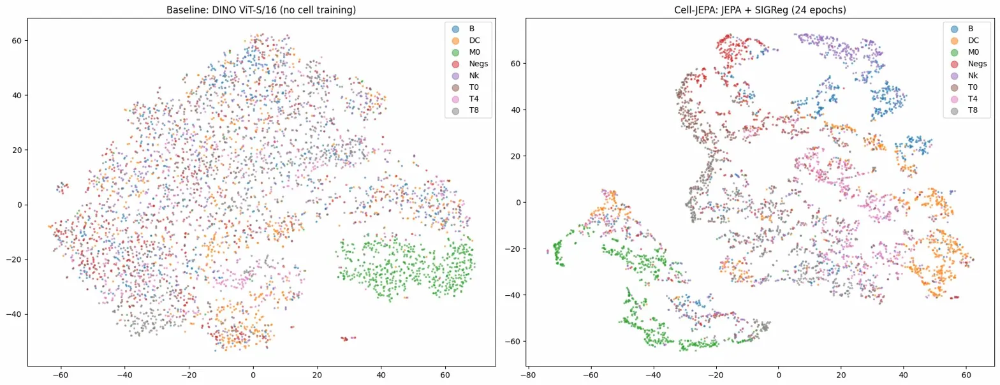
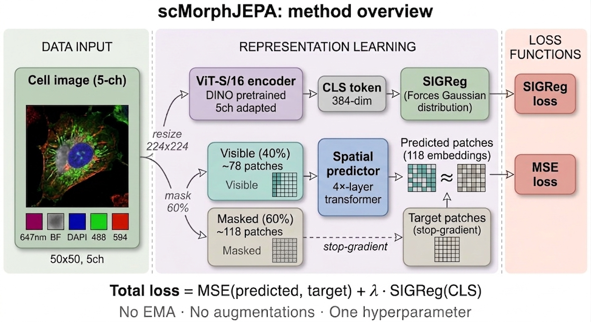

# scMorphJEPA

### Self-Supervised Cell Morphology Learning via Spatial Joint-Embedding Predictive Architecture

scMorphJEPA applies spatial masked prediction with [SIGReg](https://arxiv.org/abs/2603.19312) regularization to learn cell morphology representations from multi-channel fluorescence microscopy images, without EMA, without augmentations, and with only two loss terms.

<p align="center">
  
</p>

## Key Results

On the [Severin PBMC dataset](https://doi.org/10.3929/ethz-b-000343106) (113,564 five-channel immune cell images, 8 cell types):

| Method | Training | k-NN (k=5) | k-NN (k=10) | k-NN (k=20) |
|--------|----------|-----------|------------|------------|
| DINO ViT-S/16 (zero-shot baseline) | None | 53.2% | 55.0% | 56.1% |
| **scMorphJEPA (1K images, 30 epochs)** | ~15 min, 1xT4 | **67.6%** | **67.3%** | **66.9%** |
| **scMorphJEPA (40K images, 8 epochs)** | ~100 min, 1xT4 | **63.8%** | **63.6%** | **62.9%** |

> scMorphJEPA improves over the zero-shot pretrained baseline with only 1,000 training images, demonstrating strong data efficiency. Note: baseline and model numbers above were measured under their original preprocessing; a normalization-matched comparison and full-scale runs are in progress (see Ongoing Work).

### Normalization study (5,000 images, 40 epochs, SIGReg)

Holding data size, epochs, and objective fixed and varying only the input normalization, so the comparison isolates a single factor:

| Normalization | k-NN (k=5) | k-NN (k=10) | k-NN (k=20) |
|---------------|-----------|------------|------------|
| per_channel | 67.0% | 67.4% | 67.1% |
| per_channel_percentile | 60.5% | 61.3% | 61.3% |
| per_image | _in progress_ | _in progress_ | _in progress_ |

Robust percentile clipping (per_channel_percentile) lowers k-NN here, consistent with the brightest pixels carrying real marker signal rather than artifact. The VICReg objective on the two strongest normalizations will be added next.

## Motivation

Self-supervised vision transformers (scDINO, Cell-DINO) have shown excellent performance on cell phenotyping tasks using DINO-based self-distillation. However, these methods rely on:
- Exponential Moving Average (EMA) teacher networks
- Multi-crop augmentation strategies designed for natural images
- Complex multi-component training objectives

scMorphJEPA replaces all of this with a simpler framework inspired by [LeWorldModel (Maes et al., 2026)](https://arxiv.org/abs/2603.19312):

| | scDINO | Cell-DINO | I-JEPA | **scMorphJEPA** |
|--|--------|-----------|--------|---------------|
| Learning objective | Self-distillation | Self-distillation | Masked prediction | **Masked prediction** |
| Collapse prevention | EMA | EMA | EMA | **SIGReg** |
| Augmentations | Multi-crop, color | Multi-crop, color | None | **None** |
| EMA required | Yes | Yes | Yes | **No** |
| Loss terms | Multiple | Multiple | 2 + EMA | **2 only** |

## Method

<p align="center">
  
</p>

1. **Encode**: A ViT-S/16 encoder (initialized from DINO-pretrained ImageNet weights, adapted to 5 fluorescence channels) processes cell images into 196 patch embeddings
2. **Mask**: 60% of patch embeddings are randomly masked
3. **Predict**: A lightweight transformer predictor reconstructs masked patch embeddings from visible context
4. **Regularize**: SIGReg enforces an isotropic Gaussian distribution on embeddings, preventing collapse without EMA

**Total loss = MSE(predicted, target) + lambda * SIGReg(embeddings)**

One hyperparameter (lambda). No EMA. No augmentations. No multi-term loss.

## Dataset

We use the [Deep Phenotyping PBMC Image Set (Severin et al., 2022)](https://doi.org/10.3929/ethz-b-000343106):
- **113,564** five-channel fluorescence microscopy images
- **50x50 pixels**, resized to 224x224 for ViT input
- **5 channels**: Alexa Fluor 647, Brightfield, DAPI, FITC 488, PE 594
- **8 immune cell classes**: T4, T8, T0, M0, DC, Nk, B, Negs
- **Train/test split**: 89,564 / 24,000

## Install

From source (recommended while the package is evolving):

```bash
git clone https://github.com/simo1946/scMorphJEPA.git
cd scMorphJEPA
pip install -e .
```

Or directly:

```bash
pip install git+https://github.com/simo1946/scMorphJEPA.git
```

Requires Python 3.11+, PyTorch, and timm (installed automatically).

## Quick Start

### Download data and DINO weights

```bash
# Severin PBMC dataset
wget -O severin_pbmc.zip "https://www.research-collection.ethz.ch/bitstreams/8689d69b-d916-4c8e-9b3f-2981c512b70b/download"
unzip -q severin_pbmc.zip -d severin_data

# DINO pretrained ViT-S/16 weights
wget -O dino_vits16.pth "https://dl.fbaipublicfiles.com/dino/dino_deitsmall16_pretrain/dino_deitsmall16_pretrain.pth"
```

### Command line

```bash
python -m scmorphjepa.cli train \
    --data_dir severin_data/DeepPhenotype_PBMC_ImageSet_YSeverin \
    --checkpoint dino_vits16.pth \
    --epochs 50 --batch_size 24 --n_images 0   # 0 = use all

python -m scmorphjepa.cli evaluate \
    --model output/best_model.pt \
    --data_dir severin_data/DeepPhenotype_PBMC_ImageSet_YSeverin \
    --checkpoint dino_vits16.pth
```

### Python API

```python
from scmorphjepa.models.builder import build_scmorphjepa
from scmorphjepa.models.cell_jepa import ScMorphJEPAConfig
from scmorphjepa.data.datasets import SeverinDataset
from scmorphjepa.training.trainer import Trainer, TrainConfig

model = build_scmorphjepa("dino_vits16.pth", ScMorphJEPAConfig(in_channels=5))

train_ds = SeverinDataset("severin_data/.../Training", normalize="per_image")
val_ds   = SeverinDataset("severin_data/.../Test",     normalize="per_image")

cfg = TrainConfig(
    batch_size=24, epochs=50,
    regularizer="sigreg",      # sigreg | vicreg | koleo | barlow | none
    normalize="per_image",     # per_image | per_channel | per_channel_percentile
    n_images=0,                # 0 = use all
    output_dir="output",
)
Trainer(model, train_ds, val_ds, cfg).train()
```

Evaluate frozen embeddings with k-NN:

```python
from scmorphjepa.evaluation.evaluate import extract_embeddings, knn_evaluate

ref   = extract_embeddings(model, train_ds, batch_size=64)
query = extract_embeddings(model, val_ds,   batch_size=64)
acc = knn_evaluate(ref["cls"], ref["labels"], query["cls"], query["labels"],
                   k_values=[5, 10, 20])
print({k: f"{v:.1%}" for k, v in acc.items()})
```

Training is resumable: re-running the same configuration continues from the last completed epoch. Set `drive_checkpoint_dir` to mirror checkpoints to Google Drive for Colab.

## Repository Structure

```
scMorphJEPA/
├── README.md
├── pyproject.toml
├── scmorphjepa/            # installable package
│   ├── models/             # encoder, predictor, builder, baselines
│   ├── data/               # dataset loaders (Severin + generic folder)
│   ├── training/           # trainer + regularizers (sigreg, vicreg, koleo, barlow)
│   ├── evaluation/         # k-NN, linear probe, clustering metrics
│   ├── analysis/           # interpretability, channel attribution
│   └── cli.py              # command-line train / evaluate / analyze
├── configs/                # run configs
├── tests/
├── figures/
└── results/
    └── results_log.txt
```

## Preliminary Training Dynamics

Both prediction loss and SIGReg loss decrease consistently during training, confirming the model learns meaningful spatial structure:

| Epoch | Pred Loss (train) | SIGReg (train) | Pred Loss (val) |
|-------|-------------------|----------------|-----------------|
| 1 | 5.70 | 15.78 | 3.19 |
| 10 | 1.38 | 6.92 | 1.36 |
| 20 | 0.81 | 5.33 | 0.79 |
| 27 | 0.27 | 4.53 | 0.26 |

## Ongoing Work

- [ ] Normalization study (per_image vs per_channel vs per_channel_percentile) at matched budget
- [ ] Objective ablation (SIGReg vs VICReg vs KoLeo vs Barlow)
- [ ] Full scaling curve (1K to 89K images) with consistent training
- [ ] Normalization-matched comparison with scDINO (reproduction on same dataset)
- [ ] Cross-channel latent-predictive JEPA and channel predictability map
- [ ] Extension to Cell Painting datasets (BBBC021)

## Connection to CellAgora

scMorphJEPA is Stage 1 of the **CellAgora** research program, a multi-stage framework for AI-driven cell biology. Future stages extend to transcriptomic pairing, perturbation prediction, and spatial cell-cell interaction modeling.

## Citation

```bibtex
@article{bonaccorsi2026scmorphjepa,
  title={scMorphJEPA: Self-Supervised Cell Morphology Learning via Spatial
         Joint-Embedding Predictive Architecture},
  author={Bonaccorsi, Simone},
  year={2026},
  note={Preprint in preparation}
}
```

## Acknowledgments

This work builds on:
- [LeWorldModel](https://github.com/lucas-maes/le-wm) (Maes et al., 2026), SIGReg regularization for stable JEPA training
- [scDINO](https://github.com/JacobHanimann/scDINO) (Pfaendler et al., 2023), self-supervised ViTs for cell microscopy
- [I-JEPA](https://github.com/facebookresearch/ijepa) (Assran et al., 2023), image-based JEPA framework
- [Severin PBMC dataset](https://doi.org/10.3929/ethz-b-000343106) (Severin et al., 2022)

## License

MIT
